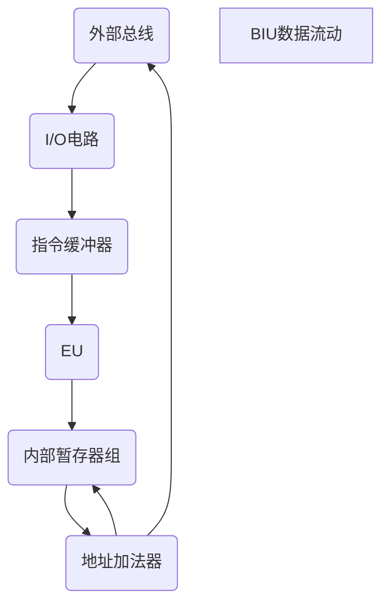
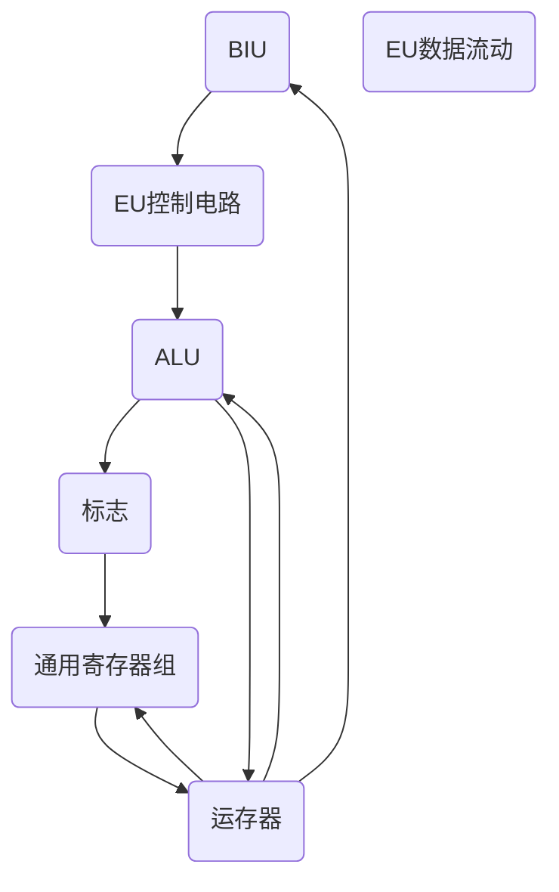

# 微机概述
微处理器(cpu)、微机、微机系统关系
![[微机组成.jpg]]
### 微机特点
1. 体积小、重量轻
2. 价格低廉
3. 可靠性高、结构灵活
4. 应用面广

## 微机组成
CPU、存储器、I/O接口、系统总线
![[微机结构.jpg]]
### CPU
#### 组成
- alu  算数逻辑单元
- 累加器和寄存器组
>累加器和通用寄存器：保存参与运算的数据及运算结果，也可放地址
>专用累加器服务于对应指令
- 控制器
>CPU控制中心，由指令寄存器、指令译码器、时序和控制电路、中断机构组成

#### 功能
- 进行算数逻辑运算
- 保存少量数据
- 能对指令进行译码并执行规定操作
- 能与存储器外设交换数据
- 提供整个系统所需要的定时和控制

### 微机
#### 微型计算机分类

##### 按功能分类
- 单片机： 大规模集成电路芯片，具备cpu，I/O接口，存储器，进具备计算机基本功能，可运行特定程序，广泛运用于仪器、仪表、家用电器、工业控制
- 个人计算机——台式机：供个人使用
- 笔记本电脑——小型台式机
- 掌上电脑——小型笔记本

##### 按微机处理字长

- 分别位4、8、16、32位

### 微机的性能指标
- cpu位数 数据线长度
- cpu主频 运算速度
- 内存容量和速度
- 硬盘容量

### 微机系统
构成：以微机为主体，配上系统软件、应用软件和外设
#### 系统软件
##### 操作系统
- cpu的运行与管理
- 文件保护
- 存储器管理
- 设备管理
- 人机界面
- 程序员界面

#### 微机系统特点
1. 结构简单，系统设计灵活，适应性强。使用方便微机多采用模块化的硬件结构，构成系统的各功能部件和各种适配器通过标准的总线槽相连，增加了系统扩充的灵活性和方便性。

2. 可靠性高，使用环境要求低。由于微机采用大规模和超大规模集成电路，系统内使用的器件数量减少，器件，部件之间的连线以及接入件数目也相应地减少，而且MOS电路本身工作所需的功耗也很低，所以微机的可靠性大大提高，进而降低了对使用环境的要求。

3. 体积小，质量轻，功耗低。由于微机中广泛采用了大规模和超大规模集成电路，从而使微机的体积大大缩小。

4. 适应性强。从系统软件到应用软件可方便地构成不同规模的微机系统，从而使微机具有很强的适应性。

5. 性能价格比高。性能价格比是指机器性能与售价之比，是衡量产品性能优劣的一个综合指标。

##### 语言处理程序

- 汇编程序
>将汇编语言程序翻译为机器语言程序（目标程序）
- 高级语言翻译程序
>将高级语言程序翻译为机器语言程序，具有编译和解释两种模式
>编译程序：将原程序整个翻译成目标语言程序，翻译完毕后执行程序
>解释程序：边翻译边执行

##### 数据库

管理系统数据，见 数据库系统

#### 应用软件
面向用户的实现特定功能的程序

#### 外部设备
使微机实现数据的输入输出功能，分为输入设备和输出设备

##### 输入设备
将文字、图像、语音输入计算机如键盘鼠标、扫描仪、光笔

##### 输出设备
显示器、打印机、绘图仪、外存（硬盘）

### 微机应用
- 科学计算
- 信息处理
- 过程控制
- 仪器仪表控制
- 家用电器和民用产品控制

## 16位32位处理器
### 认识 16bit CPU 8086
![[8fde623bff55aeba43797fa6a22f13a.jpg]]
#### 解析BLU数据流动逻辑

![[微机接口术词#BIU总线接口部件]]

#### 解析EU数据流动

![[微机接口术词#EU执行部件]]

### 8086的总线周期
由四个必要阶段和一组补充阶段组成，它存在的目的是保证CPU有组织有规划地和I/O进行数据交流，也为时间片的存在与多线程轮转工作的实现提供了可能

PS: CPU仅在与内存、I/O数据交流时才会存在总线周期，如不交流，保持空闲周期状态
1. T1（空闲周期）
	- CPU不运作，仅向总线上发出地址信息，以寻到要存储的单元或外设端口
2. T2
	- CPU从总线上撤销地址，使低16位处于高阻状态，用以下一步输送数据，高4位作为标志位，输出本总线的状态周期
	- 如中断允许状态、当前正在使用的段寄存器
3. T3 ^003
	- 准备数据交流，高4位仍为状态信息，低16位储存从CPU写出（已写至数据线上还未送至端口）或从端口读入的数据（准备空位接收信息，T4读入完毕，存在Tw么？） 
4. Tw组 ^004
	- CPU数据流动速度远远大于I/O速度，为了调节两者速度差，保证数据不丢失，设立Tw等待时间组，Tw段视情况而定，数目可以大于1
	- I/O在于CPU数据交流时，存在信号线 READY （I/0总控控制该线）,当READY不允许操作时，CPU进入 Tw组时间段 ，当允许时，CPU离开Tw组阶段，进入T4 
5. T4
	- 结束复位周期，在T4，数据传输完毕，CPU工作完毕准备进入下一周期
![[8086周期.jpg]]
### 8086引脚信号和工作模式
![[8086引脚信号.jpg]]
#### 8086引脚信号和功能
8086分时使用引脚，从而使地址线（20位）与数据线（16位）复用（总线既是地址线也是数据线，分时使用）
##### T1
1. CLK(19):时钟脉冲
	1. CPU、总线控制逻辑电路定时手段
	2. 占空比为33%：1/3高电平，2/3低电平
2. -BHE/S7 (34，高八位数据总线允许/状态复用引脚) 区分数据线传输类别：
	1. 16bit数据线，高八位传输一个字节；低八位传输一个字节；联合使用传输一个完整的字
	2. T1 时，输出-BHE，表示启用高八位输出数据，否则低八位输出数据
	3. 其他周期状态，输出状态信号S7（S7作用）
3. 高四位地址与状态线复用：A19/S6 ~ A16/S3（35 ~ 38）
	- T1状态输出地址最高四位，其余周期状态输出状态信息（CPU处于什么状态）
	- S6代表8086与总线连接情况，为0连接成功，为1未连接
	- S5代表中断标志当前设置：为1，允许可屏蔽中断；为0，禁止可屏蔽中断
	- S4 S3,表示正在使用的段寄存器
|S4|S3|含义|
|:--:|:--:|:--:|
|0|0|当前在使用ES|
|0|1|当前正在使用SS|
|1|0|当前正在使用CS，或未使用任何段寄存器|
|1|1|当前正在使用DS|
4. 2(A/D14) ~ 16(A/D0)、39(AD15)为地址、数据复用线与上条四线组成全部的地址、数据线
##### T2

##### T3、Tw
1. READY(22) 为I/O与CPU交流线，I/O通过 READY告诉CPU“我准备好了”
	- T3周期对该线进行采样，允许则进入T4，否则进入Tw，直到允许（高电平允许，低电平拒绝）
	- ![[微机接口1#^003]]
	- ![[微机接口1#^004]]
2. -TEST（23）：测试信号
	1. 与WAIT指令连用，WAIT被CPU执行时，CPU处于空转等待状态（Tw）；-TEST有效时，WAIT结束，CPU继续执行被暂停的指令

##### T4
1. RESET(21) 系统复位信号，当系统开机时，会有一个脉冲送至此处，RESET发出复位脉冲至CPU与各部件，使各处开始复位（高电平复位，低电平执行复位程序）
	1. 标志寄存器组、指令指针寄存器IP、段寄存器DS、SS、ES被清除复位（归0），但段寄存器CS被置为FFFF H
	2. 通常系统高位存储区被设置为只读存储区（存放经常使用或十分重要的命令），FFFF0 H地址段起始位置通常存放一条无条件转移指令，使CPU运行引导和装配程序（实现系统初始化、引导错做系统等功能）
		1. IP被重置为0000 H，CS为FFFF H，则系统将从FFFFO H位置执行指令，此时 RESET为低电平
		2. ![[微机接口术词#16位IP寄存器 （指令指针）]]
	3. 一般情况下复位信号必须维持4个时钟周期的高电平才有效
2. NMI(17):非屏蔽中断引脚
	1. 不受中断标志IF的影响，不受软件的屏蔽
	2. 接受正沿触发信号，CPU将会在结束当前指令后，执行对中断类型为2的非屏蔽中断处理程序
3. INTR（18）：可屏蔽中断请求信号，高电平有效允许请求
	- T4期（当前指令结束前），CPU会对 INTR 进行采样，如果此时 IF =1 ，T4末（当前指令结束后），CPU会响应中断，执行中断处理子程序
##### 尚未归类
1. -RD(32)读操作信号（输入、接收：I/O将数据送入CPU），-WR(29)写操作信号（输出：CPU将数据送至I/O）
	- 取决于M/-IO信号
2. MN/-MX（32）：最小模式、最大模式控制信号
	- 接+5V为最小模式（高电平）
	- 接地为最大模式（低电平）
3. GND/Vcc（1、20/40）
	- 地和电源，电源采用单一的+5V
4. 24 ~ 31不同模式下，名称作用不同
#### 8086最小模式
系统中仅使用（存在）一个8086微处理器，所有总线信号都由这一个处理器控制，总线控制电路可降至最少
1. -INTA（24）：输出中断响应信号
	- 响应外设中断，本质是在周期中发往外设的两个负脉冲
	- 第一个脉冲，通知外设中断被允许
	- 第二个，通知外设发送中断类型码（发送至系统总线，包含人工规定的中断信息），使CPU获得该中断的详细信息
2. ALE（25）：输出地址锁存信号，高电平有效
	- T1周期工作，通知地址锁存器当前A/D线上存储的是地址，需要进行锁存
>8086通常将8282/8283作为锁存器
>锁存器：起缓冲作用，是一种对[脉冲](https://baike.baidu.com/item/%E8%84%89%E5%86%B2/1938481?fromModule=lemma_inlink)电平敏感的存储单元。
>1.缓存
>2.完成高速的控制器与慢速的外设的不同步问题
>3.解决驱动的问题
>4.解决一个 I/O 口既能输出也能输入的问题
>锁存器是利用电平控制数据的输入，它包括不带使能控制的锁存器和带使能控制的锁存器。
3. -DEN(26)：输出数据允许信号
	- 采用8286/8287做数据收发器时起作用
	- -DEN发出有效信号提醒收发器即将有数据输出
>数据收发器：起缓冲作用，与锁存器相似，同为缓存，但目标对象为数据线信息

4. DT/-R(27)：输出数据收发信息
	- 采用8286/8287做数据收发器时起作用，控制数据传输方向
	- 高电平发送数据，低电平接收数据
	- PS:DMA模式下，为高阻状态
5. M/-IO(28)：输出 存储器/输出/输入信号
	- 高电平，CPU与存储器交流
	- 低电平，CPU与I/O交流
6. -WR(29)：输出 写信号
	表示正在进行存储器或I/O写操作，具体由M/-IO决定
7. HOLD(31) HLDA: 总线保持请求信号  总线保持响应信号 
	- 其他主模块（CPU外）请求占用总线时，向CPU发送请求信号HOLD(高电平)
	- 如果CPU允许HOLD，则T4时（当前命令完成）发送HLDA信号响应HOLD并使所有A/D线浮空（暂时不再承载CPU数据）
		- 当HLDA信号被（HOLD信息主模块）接收，控制权也被移交，HOLD与HLDA都将保持高电平
		- 该过程结束后HOLD降为低电平，HLDA随之被CPU降为低电平，总线控制权被归还给CPU
	- 如果不允许会如何？
![[8086min配置.jpg]]
8. 8086最小模式配置图
	- 

#### 8086最大模式
系统以8086为主处理器，使用两个及以上微处理器（包含8086，最少为2）：数值协作处理器8086，I/O协作处理器8089
1. 

