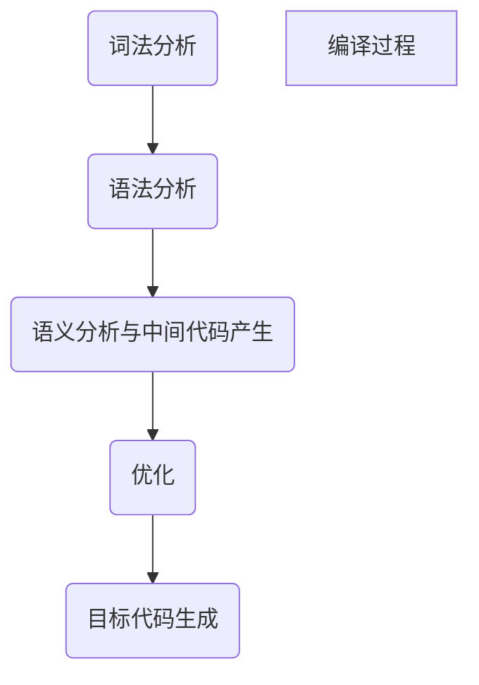

# 引论

## 定义
翻译程序是编译程序与解释程序的集合，它是将一种程序转化为另一种程序
### 翻译程序的种类
1. 编译程序（先编译后执行）
>将源语言转化为逻辑等价的目的语言（一到一，英文到中文）
>通常讲，源语言相对目的语言更高级（更简易）

2. 解释程序（不生成目标程序，对于源码边解释边执行）

## 编译程序

### 编译程序分类
1.诊断编译程序
	- 专门用于帮助程序开发和调试

2. 优化编译程序
	- 着重提高目的代码效率

3. 交叉编译程序
	- 产生不同于其宿主机的机器代码
	- 例如，在linux上编写windows程序
	- 目的是兼容有别于宿主机的其他平台系统

4. 可变目的编译程序 ^f5dd95
	- 不需要重写程序中与机器有关的部分就可以改变目标机
	- 高兼容性：程序可在不同系统中使用 

### 过程概述
编译的一般流程

1. 词法分析
	- 识别源程序每一个单词与符号（初步分析源码）
	- 清除空格、注释
2. 语法分析
	- 将（1）中分解出的字符串分解为 ***“短句”“子句”“程序段”“程序”***
	- 即将源码分成一个又一个相对独立的小块
3. 语义分析和中间代码生成
	- 分析已重新划分出的小块，对其进行初步翻译（转译成中间代码）中间代码通常为四元式序列
	- 
4. 优化
	- 提取公共子表达式（省空间）
	- 删除无效代码（省空间）
	- 优化循环（节约时间）
	- and so on ...
	- 省空间也是省时间
5. 目的代码生成
	- 将优化后的中间代码转化为机器语言
### 编译程序结构
结构与过程一一对应
1. 词法分析器
2. 语法分析器
3. 语义分析和中间代码生成器
4. 优化器
5. 目的代码生成器
6. 表格管理与出错处理

#### 表格管理与出错处理
中间代码的四元式序列实际上以表格形式存在，同时词、字、符也是以表格的形式存储，表格中也同时存储词、字、符的附加信息：占用内存、地址、类型

出错处理用于应对异常情况，比如源代码违法，源代码格式错误，环境不支持源码

#### 遍
将源程序或源程序中间结果从头到尾扫描一遍

一个完整的源码可能要分为好几个段落，每扫描一个段落称扫描了一编，变数越多，输入输出所消耗的时间就越多，源码完整遍历时间就越长，在情况允许下，尽量减少遍数

#### 编译前端与后端
前端：与源语言有关但与目标机语言无关
>一般包括词法分析、语法分析、语义分析、中间代码产生（部分代码优化部分也在前端）

后端：编译程序中与目标机有关的部分
>一般包括代码优化、代码生成
>PS：如要实现可变目的编译程序，一般都是对后端进行操作
>![[编译原理（1）#^f5dd95]]

#### 程序设计环境
