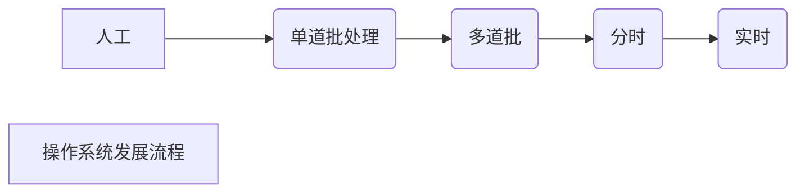

# 操作系统引论
OS Operating System
## 概论
### 目的
- 方便性
- 有效性
- 可扩充性
- 开放性

### 作用
1. 用户与计算机硬件系统之间的接口
     - OS使用计算机的三种方法
     - 命令方式
     - 系统调度
     - 图标——窗口
2. 计算机系统资源的管理者
     - 主要分以下四个方面
     - 处理机 分配控制处理及
     - 存储器  内存的分配与回收
     - I/O设备 I/O设备的分配（回收）与操纵
     - 文件（数据与程序）存取共享和保护
3. 实现了对计算机资源的抽象
     - 存在裸机（无任何软件）
     - 裸机仅提供原始硬件接口，无统一调度、控制，裸机实现功能所需的操作复杂
     - OS在初始I/O接口上覆盖一层I/O软件，当用户操作计算机时，仅需对I/O软件发出指令，I/O软件按设定好的程序对I/O进行操作，通过这种方式我们可以将原本复杂的操作方式简单化
     - 这就是对计算机资源的抽象
     - PS：扩充机器/虚机器：覆盖了软件的裸机
### 发展动力
1. 不断提高计算机资源利用率
2. 方便用户
3. 器件的不断更新换代
4. 计算机体系结构的不断发展
5. 不断提出新的应用需求

## 发展

### 人工
1. 初始方式，人工操作数据输入
    - 单一用户独占全机，上一用户未操作完毕，下一用户不得操作
    - CPU处理程序必须等待人工输入数据，二者数据处理速度差距过大，大量CPU资源被闲置
2.脱机输入输出
	- 外围机控制数据输入

### 单道批

### 多道批
一次将若干个作业提交进CPU，他们共享CPU和系统的资源。作业A暂停时，可运行作业B，保证CPU永不闲置
*/*
#### 优点
1. 资源利用率高
2. 系统吞吐量大
3. 平均周转时间长
	- 仍然是依次处理作业，一次仅处理一个，但同时吞入了若干作业，故周转时间长
4. 无交互能力
	- 在作业完成之前，用户与作业无法产生交互，修改和调试系统麻烦

#### 改进方向
1. 资源调配问题
	1. 处理机争用
	2. 内存分配与保护
	3. I/O分配
	4. 作业管理
2. 文件组织管理
	- 有效组织系统中的大量文件，兼顾便于用户使用与数据安全性
3. 用户与系统接口 （实时交互问题）这也是致命缺点

### 分时
1. 满足人机交互
2. 可以共享主机
	1. 20世纪60年代，主机昂贵，一台主机供给多人使用，此时的主机满足一对多独立交互（可配给多台显示器、键盘等终端）

#### 处理的问题（实现方法）
1. 及时接取多个用户键入的命令与数据
2. 及时处理 一对多独立交互下，各终端的作业都必须驻留内存，并可频繁被处理机运行
	- 全新运行方式
	- 作业直接进入内存
	- 采用轮转运行  设定处理机使用周期（时间片），每一作业分配独立的若干时间片运行，任一作业，每次只运行一个时间片，过期轮换

#### 分时系统特征
1. 多路性 ^73a28a
	- 主机一对多，主机资源为公共资源，不同外设终端均可操作主机
2. 独立性
	- 各终端相互独立
3. 及时性
	- 终端与主机交互是实时进行的
4. 交互性
	- 终端可以与主机交互

### 实时（及时计算）
系统及时响应外部请求，在规定时间内完成对该事件处理，并控制所有实时任务协调一致运行

#### 系统类型
1. 工业（武器）控制系统
2. 信息查询系统
3. 多媒体系统
4. 嵌入式系统  （家用电器）

#### 系统操作类型
1. 周期性实时任务与非周期性实时任务
	- 周期：外设周期性将数据传入处理机（如鼠标），要求它按周期循环执行
	- 非周期，无明显周期性，但一定存在截止时间：
		1. 开始截至时间：何时之前必须开始
		2. 结束截止时间：何时之前必须结束
2. 硬实时任务与软实时任务
	- 硬~，必须满足任务的截至时间，如武器、工业任务，过期后果严重
	- 软~，不必严格遵循截至时间，过期后果影响小，如信息查询、多媒体

#### 实时系统的特征
1. 多路性
	- 系统周期性对多路现场信息进行采集，以及对多个对象或多个执行机构及进行控制
2. 独立性
	- 对信息的采集和对对象的控制彼此互不干扰
3. 及时性
	- 控制对象严格遵循截止时间，一般精确到秒级或毫秒级（可以提前或按时，但不得超期）
4. 交互性
	- 交互性较分时小，用户只通过接口与系统交流，用户只能也仅需某些特定命令就可满足需求，用户命令在后端运行，前端只显示结果
5. 可靠性
	- 实时系统要求本身高度可靠，不得存在差错，（往往采取多级容错措施来保障系统的安全性及数据安全性）

### 分时与实时比较
![[计算机操作系统（1）#分时系统特征]]
![[计算机操作系统（1）#实时系统的特征]]
##### 本质区别
分时系统实际上是为了处理多用户处理同一终端的需求，它要保证各用户均独立存在，均能享用计算机全部资源，但每位用户又是平等的个体，所以主机将个用户任务都存入内存，分时间片，轮转执行各任务（多线程）。分时系统不存在截止时间，它仅仅需要各用户平等且各用户满意任务处理速度。

实时系统实际上是为了便于系统更好地处理用户需求，对数据的处理、维护都由系统管理，普通用户无法参与（这大大保证了系统及数据的安全性）。用户只需给定命令和截止时间，系统会按照截止时间自动完成命令。实时更加严谨更加“及时”，它的作用就在于及时处理用户命令。

### 微机操作系统

### 嵌入式操作系统

### 分布式操作系统

### 网络式操作系统

### OS的特征
1. 并发（提高系统吞吐量，提高资源利用率）
	1. 并行与并发
		- 并行：两个及以上事件***同时运行（同一时刻）
		- 并发：两个及以上事件在***同一时间间隔***发生
	2. 引入进程
		- 进程就是经处理的程序，可以并发执行
		- 在无进程系统中，同一程序的计算程序与I/O程序只能顺序执行，但进入进程后可并发进行，这大大加快处理任务的速度
2. 共享  （资源的复用，同一时间内，不同程序都可调用同一数据或资源）
	1. 互斥共享 （资源在某一时间段（大于时间片）仅能供给一个过程）
		- 某些资源同时只能有一个程序进行，如打印机、磁带（程序调用互斥）
		- 保证正在使用的进程不被打断，新进程可以调用，则采用请求方式
		- 进程调用某一互斥资源，需向系统发出请求，如资源空闲，请求被允许；如在使用，则进入等待
	2. 同时访问 （资源不互斥/资源调用可以在一个时间片内完成或支持轮换）
		- 在微观上（处理器层面）同一文件在同一时间只能被一个进程调用；但在宏观上，由于调用时间极小（一个时间片内），即使不同进程轮换进行，但人无法察觉极小的时间差距，因此主观上的体验是资源被同时调用
3. 虚拟 将物理实体转变为逻辑上的对应功能（开发实体对于系统命令的服务），通过时空复用和空分复用实现
	1. 时空复用技术 （空闲时间调用，资源切分或重复利用）
		1. 虚拟机处理技术 将任务转化为进程，使得实现多任务并发进行，从而实现多用户独立使用主机（分时系统，从程序独立实现）
		2. 虚拟设备技术 复时服用在处理机上虚拟。将原本的实体I/O分解为多套虚拟I/O，达到逻辑上的一台主机即配套资源分解为多套相同资源
4. 异步
	1. 将进程的处理分为若干段，各个进程的处理段交叉进行（走停走停）

# 进程的描述与控制
## 前趋图
